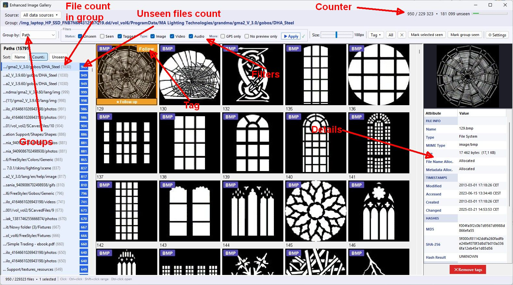
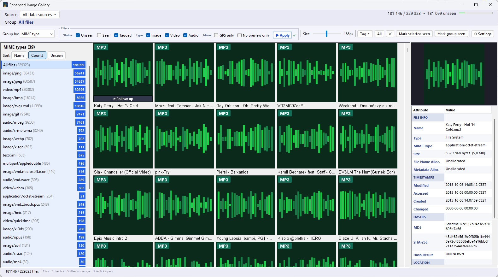
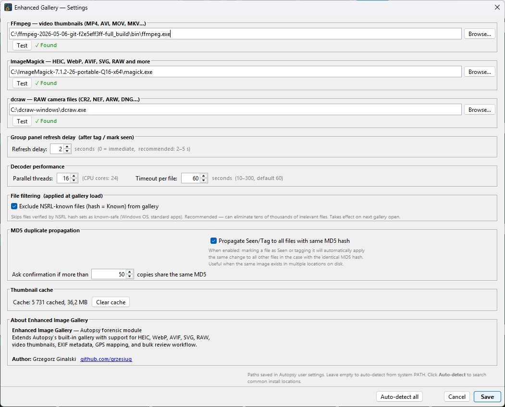

# Enhanced Image Gallery — Autopsy Forensic Module

[](LICENSE-2.0.txt)
[](https://www.autopsy.com/)
[]()

An extended media gallery plugin for [Autopsy® Digital Forensics Platform](https://www.autopsy.com/) that replaces the built-in Image Gallery with support for modern image formats, video thumbnails, EXIF metadata, GPS mapping, and a bulk review workflow optimized for large forensic cases.

---

## Screenshots


*Main gallery window — thumbnail grid with group sidebar and properties panel*


*Grouping by MIME type — instantly see all HEIC, WebP, MP4, SVG files*


*Settings — configure external tools, decoder timeout, MD5 propagation*

---

## Features

### Extended Format Support
| Format | Native Autopsy | This Module |
|--------|---------------|-------------|
| JPEG, PNG, GIF, BMP | ✓ | ✓ |
| HEIC / HEIF | ✗ | ✓ via ImageMagick |
| WebP, AVIF | ✗ | ✓ via ImageMagick |
| SVG / SVGZ | ✗ | ✓ via Apache Batik |
| RAW (CR2, NEF, ARW, DNG…) | ✗ | ✓ via dcraw |
| Video (MP4, MOV, AVI, MKV…) | ✗ | ✓ thumbnail via FFmpeg |
| Audio (MP3, M4A, AAC…) | ✗ | ✓ waveform placeholder |

### Core Features
- **Persistent thumbnail cache** — decoded once, instant on subsequent opens (`<case>/ModuleOutput/enhanced_gallery/gallery.db`)
- **Lazy viewport decoding** — only decodes thumbnails currently visible on screen
- **All data sources** — includes files from disk images, logical sets, archives (ZIP/RAR), and carved files
- **NSRL filtering** — optionally excludes known-safe OS/application files from the gallery

### Review Workflow
- **Unseen / Seen / Tagged** status per file, persisted in SQLite
- **MD5 propagation** — marking a file automatically applies the same action to all duplicates
- **Bulk "Mark seen"** — mark selected files or the entire current group
- **Tag integration** — tags written to Autopsy Blackboard, visible in Tags section

### Grouping & Filtering
- Group by: **Path, Extension, MIME type, Modified, Accessed, Created, Changed, Tag**
- Filter by: **Status** (Unseen/Seen/Tagged), **Type** (Image/Video/Audio), **GPS only**, **No preview only**
- Sort groups by: Name, Count, Unseen count
- Filter by **data source** — all sources always listed even if they contain no media

### Properties Panel
- File metadata: type, MIME, size, allocation status, all timestamps, MD5, SHA-256, NSRL status
- **EXIF data** from Autopsy Blackboard artifacts
- **GPS coordinates** with **"Open in Google Maps"** button
- Tag management with multi-tag support (same as Autopsy)

### External Viewer Integration
- Double-click opens file using **Autopsy's External Viewer rules** (Tools → Options → External Viewer)
- Fallback: Windows default application

---

## Requirements

- **Autopsy 4.23.1** or later
- **Windows** (tested on Windows 10/11)

### Optional External Tools (for extended format support)
| Tool | Formats | Download |
|------|---------|----------|
| [ImageMagick](https://imagemagick.org/) | HEIC, WebP, AVIF, SVG, RAW | [imagemagick.org](https://imagemagick.org/script/download.php) |
| [FFmpeg](https://ffmpeg.org/) | Video thumbnails (MP4, MOV, AVI…) | [ffmpeg.org](https://ffmpeg.org/download.html) |
| [dcraw](https://www.dechifro.org/dcraw/) | RAW camera files (CR2, NEF, ARW…) | [dechifro.org](https://www.dechifro.org/dcraw/) |

> Configure tool paths in **⚙ Settings** after installation. Use **Auto-detect all** to find tools automatically.

---

## Installation

1. Download the latest `.nbm` file from [Releases](../../releases)
2. In Autopsy: **Tools → Plugins → Downloaded → Add Plugins…**
3. Select the `.nbm` file → **Install** → **Restart Autopsy**
4. Open: **Tools → Enhanced Image Gallery** or use the toolbar button

---

## Usage

1. Open a case in Autopsy
2. Launch Enhanced Image Gallery from **Tools** menu or toolbar icon
3. Configure external tools in **⚙ Settings → Auto-detect all**
4. Browse files — use **Group by** to organize, filters to focus on what matters
5. Click thumbnails to select, double-click to open in external viewer
6. Use **Tag ▾** to apply forensic tags (synchronized with Autopsy)
7. Use **Mark selected seen** / **Mark group seen** to track review progress

---

## Building from Source

**Requirements:** Java 17+, NetBeans 17, Autopsy 4.23.1 (as NetBeans Platform)

```bat
set JAVA_HOME=C:\Program Files\Autopsy-4.23.1\jre
"C:\Program Files\NetBeans-17\netbeans\extide\ant\bin\ant.bat" -f EnhancedImageGallery nbm
```

Output: `build/org-sleuthkit-autopsy-enhancedgallery.nbm`

---

## License

Licensed under the **Apache License 2.0** — see [LICENSE-2.0.txt](LICENSE-2.0.txt)

---

## Author

**Grzegorz Ginalski**  
[github.com/grzesiug](https://github.com/grzesiug)
